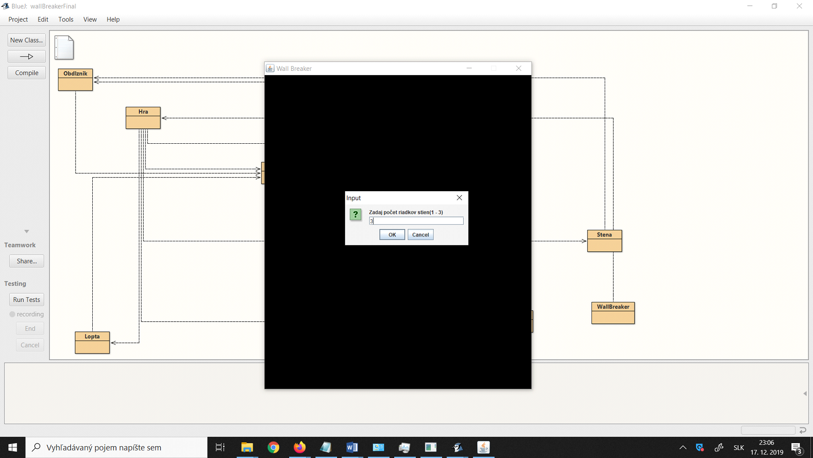
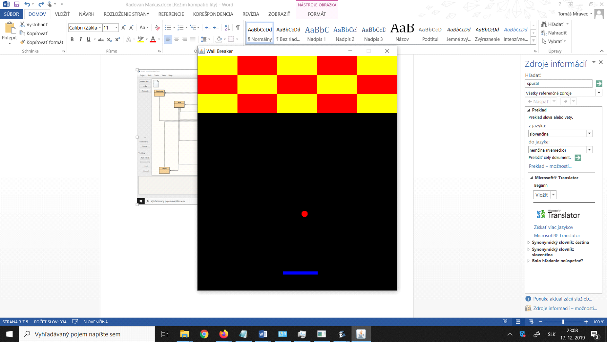
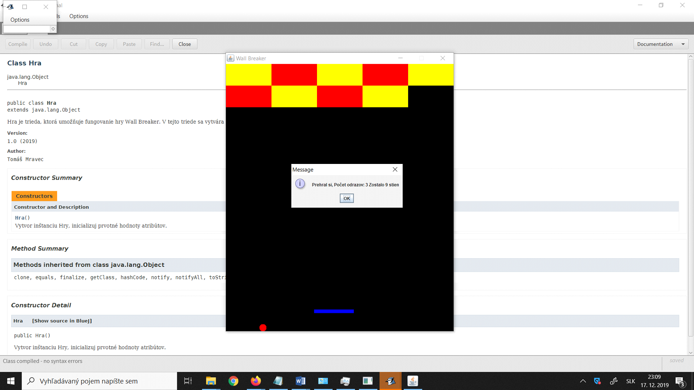

# Wall Breaker

## Návod na použitie programu

Program **Wall Breaker** je hra pre jedného hráča. Cieľom hry je zničiť všetky steny a pritom zabrániť tomu, aby sa lopta dotkla spodnej hrany obrazovky.

Hráč ovláda **modrú platformu**, ktorá sa pohybuje iba po **x-ovej osi**. Platforma sa ovláda pomocou:
- ⬅️ ľavej šípky
- ➡️ pravej šípky

Cieľom hráča je odrážať loptičku tak, aby smerovala k stenám, ktoré po kontakte s loptičkou zmiznú. Aby však stena zmizla, musí byť splnená podmienka, že **loptička má rovnakú farbu ako stena**.

Ak farby nie sú rovnaké:
- loptička sa od steny iba odrazí
- zmení svoju farbu na farbu steny, od ktorej sa odrazila

Steny môžu mať:
- 🔴 červenú farbu
- 🟡 žltú farbu

Steny sú usporiadané po **päť do jedného riadku** a ich farby sa striedajú. Počet riadkov si užívateľ vyberá na začiatku hry v rozsahu **1 až 3**.

---

## Priebeh hry

### Začiatok hry

Po spustení programu si hráč zvolí počet riadkov stien (1 – 3), ktoré sa majú vygenerovať.

  

---

### Spustená hra

Po potvrdení výberu sa hra spustí. Hráč ovláda platformu a snaží sa zničiť všetky steny.

  

---

### Prehra hráča

Ak sa loptička dotkne spodnej hrany obrazovky, hráč prehrá. Zobrazí sa okno s informáciou:
- že hráč prehral
- koľko stien bolo potrebné zničiť, aby vyhral

  

---

### Koniec hry

- Po **výhre** sa zobrazí okno s informáciou o počte úspešných odrazov loptičky
- Po **prehre** sa zobrazí okno s informáciou o neúspechu

V oboch prípadoch sa následne objaví **čierna obrazovka**.  
Ak chce hráč spustiť novú hru, musí stlačiť **medzerník**. Hra sa následne vráti na začiatok a opäť sa opýta na počet riadkov stien.

---

## Popis tried

### WallBreaker
Trieda obsahuje metódu `main`, ktorá spustí hru vytvorením inštancie triedy **Hra**.

---

### Hra
Táto trieda zabezpečuje funkcionalitu jednotlivých objektov a predstavuje **motor hry**. Spája všetky objekty do jedného funkčného celku.

- `engine()`  
  Najdôležitejšia metóda programu. V pravidelných intervaloch vykonáva herný krok, počas ktorého:
  - aktualizuje stav objektov
  - vyhodnocuje kolízie
  - určuje ďalší priebeh hry

Trieda obsahuje viacero metód na zisťovanie kolízií medzi objektmi.

---

### Lopta
Trieda reprezentujúca loptičku v hre. Obsahuje:
- x a y súradnice
- informáciu o farbe
- priemer loptičky
- ďalšie pomocné atribúty

Kontakt s platformou a stenami sa vyhodnocuje v triede **Hra**,  
kontakt s hranicami obrazovky sa kontroluje v metóde `kontrolaKontaktu()`.

---

### Obdlznik
Abstraktná trieda, ktorá slúži ako šablóna pre triedy:
- **Stena**
- **Platforma**

Obsahuje atribúty a metódy pre:
- vykresľovanie obdĺžnikov
- pohyb objektov
- prácu s ich rozmermi

---

### Stena
Trieda definujúca steny, ktoré má hráč ničiť. Je vytvorená pomocou triedy **Obdlznik**.

---

### Platforma
Trieda reprezentujúca platformu ovládanú hráčom. Platforma:
- sa pohybuje len po x-ovej osi
- má obmedzenia pohybu, aby neopustila obrazovku

Logika pohybu platformy je riešená v triede **Hra**. Platforma je vytvorená pomocou triedy **Obdlznik**.

---

### Platno
Trieda zabezpečujúca vykresľovanie všetkých objektov na plátno.

---

### Stav
Enum trieda, ktorá určuje aktuálny stav hry:
- hra beží
- hráč vyhral
- hráč prehral

